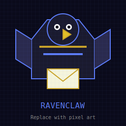

# Ravenclaw 📬

**Secure Email Bridge for Discord — Forward POP3 Emails to Discord Webhooks**

[](https://github.com/ibrahimq21/ravenclaw/stargazers)
[](https://github.com/ibrahimq21/ravenclaw)
[](https://python.org)
[](https://discord.com)

Ravenclaw is an open-source **email-to-Discord bridge** that connects your inbox to messaging platforms. Forward emails from any **POP3 server** to **Discord channels** via webhooks with zero latency. Features domain filtering, SMTP replies, auto-respond, and production-ready stability.

**Keywords:** email bridge, discord webhook, pop3 email, smtp, email notification, email forwarder, discord bot, python automation, self-hosted, email alerts, discord notifications

---
# Openclaw Skill Repository
https://github.com/ibrahimq21/openclaw-skill-ravenclaw.git

---


## What Ravenclaw Does

```
📧 Email (POP3/SMTP) → 📬 Ravenclaw → 💬 Discord (Webhook)
```

Receive email notifications directly in your Discord server. Perfect for:
- 📬 **Support tickets** — Get notified of new emails instantly
- 🔔 **Alerts** — Server notifications, monitoring alerts
- 📋 **Automation** — Trigger workflows from email content
- 🏢 **Teams** — Share emails across departments without sharing accounts

---

## Logo




## Why Ravenclaw?

| Feature | Ravenclaw | Zapier | IFTTT | Custom Solutions |
|---------|-----------|--------|-------|------------------|
| **Cost** | Free (self-hosted) | $50+/mo | Free tier limited | Dev time |
| **Privacy** | ✅ Your data stays local | ❌ Cloud | ❌ Cloud | ✅ Controlled |
| **Customization** | Full Python access | Limited | Limited | Complete |
| **Setup Time** | 5 minutes | 10 minutes | 10 minutes | Hours/Days |
| **Discord Native** | ✅ Webhook built-in | Integration needed | Integration needed | Custom dev |

### Use Cases

- 📧 **Email to Discord** — Forward emails to channels automatically
- 🔔 **Server Alerts** — Get notified of system issues in real-time
- 📬 **Support Tickets** — Route support emails to Discord channels
- 🤖 **Automation** — Trigger Discord actions from email content
- 📊 **Monitoring** — Connect email-based alerts to team chat

---

## Features

- 📥 **POP3 Email Fetching** — Securely fetch emails from any POP3 server
- 🔒 **Domain Filtering** — Whitelist allowed domains for security
- 💬 **Discord Integration** — Forward emails to Discord channels via webhooks
- 📤 **SMTP Replies** — Send email replies directly from Discord
- ⏰ **Scheduled Checks** — Configurable polling interval (default: 30 min)
- 📁 **JSON Storage** — All emails stored in readable JSON format
- 🤖 **Auto-Reply** — Automatic acknowledgment responses
- 🛡️ **Stability** — Memory leak prevention, log rotation, graceful shutdown
- ⏰ **Scheduled Emails** — Schedule emails to be sent at specific times via JSON queue
- 📋 **Scheduled Email Templates** — `example-schedule.json` provides templates for scheduling emails

---

---

## Quick Start (5 Minutes)

```bash
# 1. Clone and enter directory
git clone https://github.com/ibrahimq21/ravenclaw.git
cd ravenclaw

# 2. Install dependencies
pip install -r requirements.txt

# 3. Configure environment
cp .env.example .env
# Edit .env with your email and Discord webhook

# 4. Run the bridge
python ravenclaw.py

# 5. Test with curl
curl http://localhost:5002/health
```

**That's it!** Emails will now forward to your Discord channel.

---

## Configuration

Create a `.env` file:

```env
# Email Settings
EMAIL_HOST=mail.yourdomain.com
EMAIL_POP_PORT=995
EMAIL_SMTP_PORT=587
EMAIL_USERNAME=your@email.com
EMAIL_PASSWORD=yourpassword

# Security
DOMAIN_FILTER=example.com,allowed-domain.com

# Discord Webhook
DISCORD_WEBHOOK_URL=https://discord.com/api/webhooks/...

# Bridge Settings
BRIDGE_HOST=0.0.0.0
BRIDGE_PORT=5002
BRIDGE_POLL_INTERVAL=30
```

---

## Scheduled Emails

Schedule emails to be sent at specific times using the API or JSON queue.

### Quick Schedule via API

```bash
curl -X POST http://localhost:5002/schedule \
  -H "Content-Type: application/json" \
  -d '{
    "to": "recipient@domain.com",
    "subject": "Leave Request",
    "body": "Dear Manager,\n\nI would like to request leave...",
    "target_time": "2026-02-20T09:00:00",
    "priority": "high"
  }'
```

### Using JSON Queue

Copy `example-schedule.json` to `ravenclaw_scheduled.json` and add your emails:

```bash
cp example-schedule.json ravenclaw_scheduled.json
# Edit ravenclaw_scheduled.json with your email content
```

### Scheduled Email Schema

```json
{
  "version": "1.0",
  "emails": [
    {
      "id": "unique_id",
      "to": "recipient@domain.com",
      "subject": "Email subject",
      "body": "Email body content",
      "target_time": "2026-12-31T09:00:00",
      "created_at": "auto-generated",
      "status": "pending|sent|failed|cancelled",
      "attempts": 0,
      "priority": "normal|high|low"
    }
  ]
}
```

**Note:** `ravenclaw_scheduled.json` stores your actual scheduled emails. Use `example-schedule.json` as a template.

---

## API Endpoints

| Endpoint | Method | Description |
|----------|--------|-------------|
| `/` | GET | Bridge status |
| `/health` | GET | Health check with stats |
| `/inbox` | GET | Get all emails |
| `/inbox/<id>` | GET | Get specific email |
| `/unread` | GET | Get unread emails |
| `/send` | POST | Send email reply |
| `/check` | POST | Trigger manual email check |
| `/stats` | GET | Processing statistics |
| `/mark-read/<id>` | POST | Mark email as read |
| `/schedule` | POST | Schedule an email to be sent later |
| `/schedule/list` | GET | List all scheduled emails |
| `/schedule/cancel/<id>` | POST | Cancel a scheduled email |
| `/check-scheduled` | POST | Trigger manual scheduled email check |

---

## Stability & Memory Management

Ravenclaw includes enterprise-grade stability features:

- **Inbox Limits** — Maximum 1000 emails stored (prevents JSON bloat)
- **Log Rotation** — 1MB log files with 5 backups (prevents disk full)
- **State Trimming** — Sync state limited to 500 msg IDs
- **Graceful Shutdown** — SIGINT/SIGTERM handlers for clean exit
- **In-Memory Caching** — State cached in sync watcher (reduces I/O)

---

## Roadmap 🎯

**Phase 1 — Current**
- ✅ Discord Webhooks
- ✅ Discord Bot Integration
- ✅ JSON File Watcher
- ✅ Stability & Memory Management

**Phase 2 — Community Contributions Welcome**
- 📌 **Slack** — Channel and user notifications via Bot Token
- 📌 **Telegram** — Bot API integration for private and group chats
- 📌 **WhatsApp** — Twilio or Baileys integration
- 📌 **Matrix** — Synapse bot support
- 📌 **Email Rules** — Filter, label, and forward based on content

**Phase 3 — Advanced**
- 📋 **Multiple Accounts** — Support for multiple email/Discord pairs
- 📋 **Plugins** — Plugin architecture for custom integrations
- 📋 **Web UI** — Dashboard for managing connections

---

## Contributing

We welcome contributions! Here's how you can help:

### Adding a New Channel (e.g., Slack)

1. Create a new file: `ravenclaw_channels/slack.py`
2. Implement the channel interface:

```python
def send_message(sender, subject, body, msg_id):
    """Send email content to Slack"""
    # Your implementation
    pass
```

3. Add to `ravenclaw.py` channel registry:

```python
from ravenclaw_channels import slack, telegram

CHANNELS = {
    'discord': discord.send_message,
    'slack': slack.send_message,
    'telegram': telegram.send_message,
}
```

4. Submit a PR!

### Other Contributions
- Bug fixes and improvements
- Documentation enhancements
- Security audits
- Test coverage

---

## Architecture

```
Email Server (POP3)
       ↓
  Ravenclaw Bridge
       ↓
┌──────┴──────┐
│   Channels  │  ← Extensible plugin system
└──────┬──────┘
       ↓
Discord / Slack / Telegram / WhatsApp / ...
```

---

## License

MIT License — Feel free to use, modify, and distribute.

---


- 🐛 Report issues on GitHub
- 💬 Join our Discord community
- 📧 Email: ibrahimq21@gmail.com

**Maintainers:**
- Ibrahim Qureshi — ibrahimq21@gmail.com

---

**Built for secure, flexible email bridging. Make it yours.**
