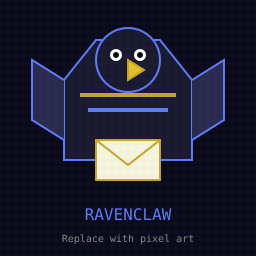

# Ravenclaw 📬

**Secure Email Bridge for Discord — Forward POP3 Emails to Discord Webhooks**

[](https://github.com/ibrahimq21/ravenclaw/stargazers)
[](https://github.com/ibrahimq21/ravenclaw)
[](https://python.org)
[](https://discord.com)

Ravenclaw is an open-source **email-to-Discord bridge** that connects your inbox to messaging platforms. Forward emails from any **POP3 server** to **Discord channels** via webhooks with zero latency. Features domain filtering, SMTP replies, auto-respond, and production-ready stability.

**Keywords:** email bridge, discord webhook, pop3 email, smtp, email notification, email forwarder, discord bot, python automation, self-hosted, email alerts, discord notifications

---
# Openclaw Skill Repository
https://github.com/ibrahimq21/openclaw-skill-ravenclaw.git

---


## What Ravenclaw Does

```
📧 Email (POP3/SMTP) → 📬 Ravenclaw → 💬 Discord (Webhook)
```

Receive email notifications directly in your Discord server. Perfect for:
- 📬 **Support tickets** — Get notified of new emails instantly
- 🔔 **Alerts** — Server notifications, monitoring alerts
- 📋 **Automation** — Trigger workflows from email content
- 🏢 **Teams** — Share emails across departments without sharing accounts

---

## Logo




## Why Ravenclaw?

| Feature | Ravenclaw | Zapier | IFTTT | Custom Solutions |
|---------|-----------|--------|-------|------------------|
| **Cost** | Free (self-hosted) | $50+/mo | Free tier limited | Dev time |
| **Privacy** | ✅ Your data stays local | ❌ Cloud | ❌ Cloud | ✅ Controlled |
| **Customization** | Full Python access | Limited | Limited | Complete |
| **Setup Time** | 5 minutes | 10 minutes | 10 minutes | Hours/Days |
| **Discord Native** | ✅ Webhook built-in | Integration needed | Integration needed | Custom dev |

### Use Cases

- 📧 **Email to Discord** — Forward emails to channels automatically
- 🔔 **Server Alerts** — Get notified of system issues in real-time
- 📬 **Support Tickets** — Route support emails to Discord channels
- 🤖 **Automation** — Trigger Discord actions from email content
- 📊 **Monitoring** — Connect email-based alerts to team chat

---

## Features

- 📥 **POP3 Email Fetching** — Securely fetch emails from any POP3 server
- 🔒 **Domain Filtering** — Whitelist allowed domains for security
- 💬 **Discord Integration** — Forward emails to Discord channels via webhooks
- 📤 **SMTP Replies** — Send email replies directly from Discord
- ⏰ **Scheduled Checks** — Configurable polling interval (default: 30 min)
- 📁 **JSON Storage** — All emails stored in readable JSON format
- 🤖 **Auto-Reply** — Automatic acknowledgment responses
- 🛡️ **Stability** — Memory leak prevention, log rotation, graceful shutdown
- 📎 **Attachments** — Base64 inline or from an allowlisted folder, on sends, drafts and scheduled mail
- 📂 **Received Attachments** — Files on incoming mail saved per sender, to a folder you can move at runtime
- 📨 **`.eml` Export** — Download any received email as the message it actually was, HTML body and full headers intact
- 📝 **Drafts** — Compose, revise, then send now or hand off to the scheduler
- 📮 **Send Tracking** — Every outgoing email recorded with timestamp, sender identity and Message-ID
- 🔁 **Duplicate Prevention** — Idempotency keys plus an automatic content window, safe under concurrency
- ⏰ **Scheduled Emails** — Schedule emails to be sent at specific times via JSON queue
- 📋 **Scheduled Email Templates** — `example-schedule.json` provides templates for scheduling emails

---

---

## Quick Start (5 Minutes)

```bash
# 1. Clone and enter directory
git clone https://github.com/ibrahimq21/ravenclaw.git
cd ravenclaw

# 2. Install dependencies
pip install -r requirements.txt

# 3. Configure environment
cp .env.example .env
# Edit .env with your email and Discord webhook

# 4. Run the bridge
python ravenclaw.py

# 5. Test with curl
curl http://localhost:5002/health
```

**That's it!** Emails will now forward to your Discord channel.

---

## Configuration

Create a `.env` file:

```env
# Email Settings
EMAIL_HOST=mail.yourdomain.com
EMAIL_POP_PORT=995
EMAIL_SMTP_PORT=587
EMAIL_USERNAME=your@email.com
EMAIL_PASSWORD=yourpassword

# Security
# Applies to inbound mail AND every outbound recipient (To, CC, BCC)
DOMAIN_FILTER=example.com,allowed-domain.com

# API key - required for every endpoint except /health
RAVENCLAW_API_KEY=generate-with-secrets-token-urlsafe

# Discord Webhook
DISCORD_WEBHOOK_URL=https://discord.com/api/webhooks/...

# Bridge Settings
BRIDGE_HOST=127.0.0.1
BRIDGE_PORT=5002
BRIDGE_POLL_INTERVAL=30
```

### API Authentication

The API can read your entire inbox and send mail as your account, so it is
**not** open. Generate a key:

```bash
python -c "import secrets; print(secrets.token_urlsafe(32))"
```

Put it in `.env` as `RAVENCLAW_API_KEY`, then pass it on every request:

```bash
curl -H "X-API-Key: your-key-here" http://localhost:5002/inbox
```

**Named keys (preferred).** Give each client its own key so every send is
attributed to a caller you can identify and revoke independently:

```env
RAVENCLAW_API_KEYS=alice:key_aaa,bot:key_bbb,scheduler:key_ccc
```

The actor name on the left is recorded as `sent_by` on everything that key
sends. A single `RAVENCLAW_API_KEY` still works and is attributed to
`default`; you can set both.

- `/health` is the only route that does not require a key.
- Without `RAVENCLAW_API_KEY` set, all other routes return **503**.
- `BRIDGE_HOST` defaults to `127.0.0.1`. The bridge **refuses to start** on a
  non-loopback address unless an API key is set — and even then, put it behind
  a reverse proxy with TLS rather than exposing it directly.

---

## Attachments

Supported on `/send`, `/schedule`, and drafts. Two forms, mixable in one message:

```bash
curl -X POST http://localhost:5002/send \
  -H "X-API-Key: k" -H "Content-Type: application/json" \
  -d '{
    "to": "someone@example.com",
    "subject": "Quarterly report",
    "body": "See attached.",
    "attachments": [
      {"filename": "notes.txt", "content": "aGVsbG8gd29ybGQ="},
      {"file": "report.pdf"}
    ]
  }'
```

- **`content`** — base64 of the file. Self-contained, needs no filesystem access.
- **`file`** — a name resolved **inside `ATTACHMENT_DIR` only**. Absolute paths
  and `..` escapes are rejected, and the check is done on the resolved real
  path so symlinks cannot point outside either. This is deliberate: without it,
  any caller could name any file the bridge can read and have it mailed out.

`content_type` is guessed from the extension when not supplied. Limits default
to 10 MB per file and 25 MB per message (`MAX_ATTACHMENT_BYTES`,
`MAX_TOTAL_ATTACHMENT_BYTES`) — your mail server likely enforces a lower one.

Drafts and queued mail keep attachment **bytes in a content-addressed store**
(`ATTACHMENT_STORE`), not inline in the JSON, so a queued PDF does not bloat
`ravenclaw_scheduled.json` and the same file attached repeatedly is stored once.
Blobs are garbage-collected once nothing references them. If a blob goes missing
before a scheduled send, that entry is marked `failed` rather than quietly
sending a message with no attachment.

## Received Attachments

Files that arrive **on** incoming mail are written to disk automatically, one
folder per sender:

```
inbox_attachments/
  ali.khan_at_example.com/
    invoice.pdf
    photo.jpg
  billing_at_vendor.co/
    statement.pdf
```

This is a separate tree from `ATTACHMENT_STORE` on purpose. That store is
garbage-collected against drafts and the scheduled queue, so received files
kept there would be deleted on the next sweep.

The sender address is reduced to a safe folder name (`A.Khan@Corp.com` ->
`a.khan_at_corp.com`): everything outside a conservative whitelist becomes
`_`, so a crafted `From` header cannot introduce a path separator or a `..`
segment and write outside the folder.

Each stored file is listed on its email in `/inbox`:

```json
{
  "id": "<CAF...@mail.gmail.com>",
  "sender": "ali.khan@example.com",
  "subject": "August invoice",
  "attachments": [
    {
      "filename": "invoice.pdf",
      "content_type": "application/pdf",
      "size": 102416,
      "sha256": "4a82be...",
      "dir": "inbox_attachments",
      "path": "ali.khan_at_example.com/invoice.pdf",
      "saved_at": "2026-08-30T15:43:00+00:00"
    }
  ]
}
```

The record carries **both** the base folder and the path relative to it, so
moving the inbound folder later does not break attachments already stored.

Fetch them back with:

```bash
# what came with this email
curl -H "X-API-Key: k" "http://localhost:5002/inbox/<id>/attachments"

# download the first one
curl -H "X-API-Key: k" -OJ "http://localhost:5002/inbox/<id>/attachments/0"
```

A file resent unchanged by the same sender reuses the copy already on disk; a
different file arriving under a name already taken is saved as
`invoice (2).pdf`. A file over `MAX_INBOUND_ATTACHMENT_BYTES` (10 MB) or
pushing the message past `MAX_INBOUND_TOTAL_BYTES` (25 MB) is skipped and
noted with a `skipped` reason — the rest of the email is stored as normal.

### Changing where they are stored

The location is `INBOUND_ATTACHMENT_DIR` in `.env`, and it can also be changed
**while the bridge is running**:

```bash
curl -H "X-API-Key: k" http://localhost:5002/config/attachments

curl -X PUT http://localhost:5002/config/attachments \
  -H "X-API-Key: k" -H "Content-Type: application/json" \
  -d '{"inbound_dir": "D:/MyMail/files"}'
```

The new folder is created and probe-written **before** anything changes, so a
bad path is rejected with `400` while the working one stays in force. On
success the value is written back to `.env`, so the change survives a restart:

```json
{"ok": true, "inbound_dir": "D:/MyMail/files",
 "previous_dir": "inbox_attachments", "moved": 0,
 "persisted": true, "restart_required": false}
```

Files already saved stay where they are and still download correctly, because
each record knows its own folder.

Pass `"move_existing": true` to relocate the existing sender folders as well.
That merges into any sender folder already present at the destination rather
than nesting one inside the other, and rewrites the folder recorded on every
affected inbox entry, so nothing is left pointing at bytes that have moved. If
you move the folder by hand instead, stored attachments are still found: a
record whose folder no longer holds the file is retried against the folder in
force now.

Send `{"enabled": false}` to receive mail without keeping attachments at all.

## Downloading a Received Email as `.eml`

`/inbox/<id>` gives you the stored fields — sender, subject, plain-text body.
That is not the email. Any HTML part, the `Received` trail, the DKIM signature
and inline images are not in there. To get the message itself:

```bash
curl -H "X-API-Key: k" -OJ "http://localhost:5002/inbox/<id>/raw.eml"
```

The result opens in Outlook, Thunderbird, Apple Mail or anything else that
reads `.eml`, and is named after the subject.

Every received email is kept whole in `RAW_EML_DIR` (`ravenclaw_raw/`) as it
arrived, so what comes back is byte-for-byte the original. That store is
content-addressed — the same message re-fetched after a POP3 renumber costs one
file — and a blob is deleted only when its email falls off the end of the
inbox.

### Mail received before this existed

Raw messages are only kept from the moment the feature landed, and older
records have no copy to serve. Those are **rebuilt** from the stored fields and
the attachment files on disk. A rebuilt message is valid and opens normally,
but it is not the original, so it never pretends to be one:

| | |
|---|---|
| `X-Ravenclaw-Eml-Source` response header | `raw` or `reconstructed` |
| `X-Ravenclaw-Reconstructed` | `yes`, on the response **and** inside the file |
| `X-Ravenclaw-Note` | what was lost, in the file itself |
| `X-Ravenclaw-Missing-Attachment` | one per file that could not be put back |

`Date` on a rebuilt message is when **Ravenclaw received** it, not the sender's
`Date` header — that was never stored. The note header says so.

### Choosing

```bash
# default: the original if it was kept, otherwise a rebuild
curl -H "X-API-Key: k" -OJ "http://localhost:5002/inbox/<id>/raw.eml"

# the original or nothing - 410 if it was not retained
curl -H "X-API-Key: k" -OJ "http://localhost:5002/inbox/<id>/raw.eml?mode=raw"

# force a rebuild even when the original is on hand
curl -H "X-API-Key: k" -OJ "http://localhost:5002/inbox/<id>/raw.eml?mode=reconstruct"
```

A Message-ID contains `<`, `>` and `@`, so **URL-encode it**:

```bash
curl -H "X-API-Key: k" -OJ \
  "http://localhost:5002/inbox/%3Cabc123%40example.com%3E/raw.eml"
```

Or just use the POP3 message number, which needs no encoding:

```bash
curl -H "X-API-Key: k" -OJ "http://localhost:5002/inbox/377/raw.eml"
```

Downloading does **not** mark the email read — this is an export, not a read.
Use `/mark-read/<id>` if you want the flag.

## Drafts

Compose now, send later.

```bash
# create, with an attachment
curl -X POST http://localhost:5002/draft -H "X-API-Key: k" \
  -H "Content-Type: application/json" \
  -d '{"to":"a@example.com","subject":"Draft","body":"...",
       "attachments":[{"file":"report.pdf"}]}'

# revise it; add_attachments appends, attachments replaces the whole list
curl -X PATCH http://localhost:5002/draft/<id> -H "X-API-Key: k" \
  -H "Content-Type: application/json" \
  -d '{"body":"revised","add_attachments":[{"file":"annex.pdf"}]}'

curl -X POST http://localhost:5002/draft/<id>/send -H "X-API-Key: k"
# ...or hand it to the scheduler instead
curl -X POST http://localhost:5002/draft/<id>/schedule -H "X-API-Key: k" \
  -H "Content-Type: application/json" -d '{"target_time":"2026-09-01T09:00:00"}'
```

Recipients are validated against `DOMAIN_FILTER` when the draft is created,
when it is edited, and again at send time. Sending is keyed on the draft id, so
a double-click cannot send it twice, and a draft that is already `sent` or
`scheduled` returns `409` on further edits or sends.

## Send Tracking & Duplicate Prevention

Every outgoing email — API call, Discord command, auto-reply, or scheduled
send — is recorded in `ravenclaw_outbox.json` and queryable via `/sent`.

### What gets recorded

```json
{
  "id": "4f9c2a1e...",
  "message_id": "<176...@yourdomain.com>",
  "to": "recipient@example.com",
  "cc": [], "bcc": [],
  "subject": "Re: Leave Request",
  "sent_by": "bot",
  "on_behalf_of": "carol#1234",
  "source": "api",
  "sent_at": "2026-08-12T14:31:07.442918+00:00",
  "status": "sent",
  "error": null,
  "idempotency_key": "discord:1274...",
  "content_hash": "9f86d0..."
}
```

- **When** — `sent_at` is timezone-aware UTC, stamped on actual delivery.
  Ravenclaw now also sets its own `Message-ID` and `Date` headers, so a send
  can be correlated with the copy in the recipient's mailbox and with any
  later reply.
- **Who** — `sent_by` is the actor that owns the API key used, so it cannot be
  spoofed by the request body. `on_behalf_of` is an optional display label for
  the human behind an automated caller; the Discord bot fills it with the user
  who typed `!send`.
- **Where from** — `source` is one of `api`, `auto-reply`, `scheduled-queue`.

### Replies vs. new mail

Pass `in_reply_to` (and optionally `references`) to send a reply: Ravenclaw
sets the threading headers so the message lands in the right conversation, and
prefixes the subject with `Re: ` if it does not already start with one. A send
without those fields is treated as new mail and its subject is left exactly as
given.

### Duplicate prevention

Two layers, both enforced inside a lock that covers the whole
check → send → record sequence, so concurrent callers cannot both slip through:

**1. Idempotency keys (exact, any age).** Send an `Idempotency-Key` header; a
replay returns the original record and does not re-send.

```bash
curl -X POST http://localhost:5002/send \
  -H "X-API-Key: your-key-here" \
  -H "Idempotency-Key: invoice-2026-08-12" \
  -H "Content-Type: application/json" \
  -d '{"to":"a@example.com","subject":"Invoice","body":"..."}'
```

Replays return `"duplicate": true` with the original `id` and `sent_at`.

**2. Content window (automatic fallback).** Callers that send no key are still
protected: an identical message — same recipients, subject and body — inside
`SEND_DEDUPE_WINDOW` seconds (default 300) is suppressed. Set it to `0` to
rely on idempotency keys alone.

Internal senders get keys automatically: scheduled mail is keyed on its queue
entry id, and auto-replies on the incoming `Message-ID`, so neither can go out
twice even across a restart or overlapping sweeps.

Failed sends are recorded with `status: "failed"` but are **not** treated as
duplicates, so a genuine retry after an SMTP outage still goes through.

### Querying what was sent

```bash
curl -H "X-API-Key: k" "http://localhost:5002/sent?sent_by=alice&limit=20"
curl -H "X-API-Key: k" "http://localhost:5002/sent?status=failed"
curl -H "X-API-Key: k" "http://localhost:5002/sent?since=2026-08-01T00:00:00Z"
curl -H "X-API-Key: k" "http://localhost:5002/sent/<id-or-message-id>"
```

`/stats` also reports `sent_total`, `sent_ok`, `sent_failed`, `last_sent_at`
and a `sent_by_actor` breakdown.

---

## Scheduled Emails

Schedule emails to be sent at specific times using the API or JSON queue.

### Quick Schedule via API

```bash
curl -X POST http://localhost:5002/schedule \
  -H "Content-Type: application/json" \
  -H "X-API-Key: your-key-here" \
  -d '{
    "to": "recipient@domain.com",
    "subject": "Leave Request",
    "body": "Dear Manager,\n\nI would like to request leave...",
    "target_time": "2026-02-20T09:00:00",
    "priority": "high"
  }'
```

### Using JSON Queue

Copy `example-schedule.json` to `ravenclaw_scheduled.json` and add your emails:

```bash
cp example-schedule.json ravenclaw_scheduled.json
# Edit ravenclaw_scheduled.json with your email content
```

### Scheduled Email Schema

```json
{
  "version": "1.0",
  "emails": [
    {
      "id": "unique_id",
      "to": "recipient@domain.com",
      "subject": "Email subject",
      "body": "Email body content",
      "target_time": "2026-12-31T09:00:00",
      "created_at": "auto-generated",
      "status": "pending|sent|failed|cancelled",
      "attempts": 0,
      "priority": "normal|high|low"
    }
  ]
}
```

**Note:** `ravenclaw_scheduled.json` stores your actual scheduled emails. Use `example-schedule.json` as a template.

---

## API Endpoints

All endpoints except `/health` require an `X-API-Key` header (see
[API Authentication](#api-authentication)).

| Endpoint | Method | Auth | Description |
|----------|--------|------|-------------|
| `/` | GET | ✅ | Bridge status |
| `/health` | GET | — | Health check with stats |
| `/inbox` | GET | ✅ | Get all emails |
| `/inbox/<id>` | GET | ✅ | Get specific email |
| `/inbox/<id>/attachments` | GET | ✅ | Files that arrived with one email |
| `/inbox/<id>/attachments/<n>` | GET | ✅ | Download the nth received file |
| `/inbox/<id>/raw.eml` | GET | ✅ | Download the email itself as a `.eml` |
| `/unread` | GET | ✅ | Get unread emails |
| `/send` | POST | ✅ | Send email (honours `Idempotency-Key`) |
| `/draft` | POST | ✅ | Create a draft |
| `/draft` | GET | ✅ | List drafts; filter by `created_by`, `status` |
| `/draft/<id>` | GET | ✅ | Read one draft |
| `/draft/<id>` | PATCH | ✅ | Edit a draft, add or remove attachments |
| `/draft/<id>` | DELETE | ✅ | Discard a draft |
| `/draft/<id>/send` | POST | ✅ | Send a draft now |
| `/draft/<id>/schedule` | POST | ✅ | Promote a draft into the scheduled queue |
| `/sent` | GET | ✅ | Record of sent mail; filter by `sent_by`, `source`, `status`, `since`, `limit` |
| `/sent/<id>` | GET | ✅ | One sent email, by outbox id or Message-ID |
| `/check` | POST | ✅ | Trigger manual email check |
| `/stats` | GET | ✅ | Processing statistics |
| `/mark-read/<id>` | POST | ✅ | Mark email as read |
| `/mark-all-read` | POST | ✅ | Mark all emails as read |
| `/schedule` | POST | ✅ | Schedule an email to be sent later |
| `/schedule/list` | GET | ✅ | List all scheduled emails |
| `/schedule/cancel/<id>` | POST | ✅ | Cancel a scheduled email |
| `/check-scheduled` | POST | ✅ | Trigger manual scheduled email check |
| `/config/attachments` | GET | ✅ | Where received attachments are stored |
| `/config/attachments` | PUT | ✅ | Move that folder without a restart |

**Recipient filtering:** `/send` and `/schedule` validate `to`, `cc` **and**
`bcc` against `DOMAIN_FILTER`. Any disallowed recipient rejects the whole
request with `403` and a `rejected` list naming the offending addresses.

---

## Stability & Memory Management

Ravenclaw includes enterprise-grade stability features:

- **Inbox Limits** — Maximum 1000 emails stored (prevents JSON bloat)
- **Log Rotation** — 1MB log files with 5 backups (prevents disk full)
- **State Trimming** — Sync state limited to 500 msg IDs
- **Graceful Shutdown** — SIGINT/SIGTERM handlers for clean exit
- **In-Memory Caching** — State cached in sync watcher (reduces I/O)

---

## Roadmap 🎯

**Phase 1 — Current**
- ✅ Discord Webhooks
- ✅ Discord Bot Integration
- ✅ JSON File Watcher
- ✅ Stability & Memory Management

**Phase 2 — Community Contributions Welcome**
- 📌 **Slack** — Channel and user notifications via Bot Token
- 📌 **Telegram** — Bot API integration for private and group chats
- 📌 **WhatsApp** — Twilio or Baileys integration
- 📌 **Matrix** — Synapse bot support
- 📌 **Email Rules** — Filter, label, and forward based on content

**Phase 3 — Advanced**
- 📋 **Multiple Accounts** — Support for multiple email/Discord pairs
- 📋 **Plugins** — Plugin architecture for custom integrations
- 📋 **Web UI** — Dashboard for managing connections

---

## Contributing

We welcome contributions! Here's how you can help:

### Adding a New Channel (e.g., Slack)

1. Create a new file: `ravenclaw_channels/slack.py`
2. Implement the channel interface:

```python
def send_message(sender, subject, body, msg_id):
    """Send email content to Slack"""
    # Your implementation
    pass
```

3. Add to `ravenclaw.py` channel registry:

```python
from ravenclaw_channels import slack, telegram

CHANNELS = {
    'discord': discord.send_message,
    'slack': slack.send_message,
    'telegram': telegram.send_message,
}
```

4. Submit a PR!

### Other Contributions
- Bug fixes and improvements
- Documentation enhancements
- Security audits
- Test coverage

---

## Architecture

```
Email Server (POP3)
       ↓
  Ravenclaw Bridge
       ↓
┌──────┴──────┐
│   Channels  │  ← Extensible plugin system
└──────┬──────┘
       ↓
Discord / Slack / Telegram / WhatsApp / ...
```

---

## License

MIT License — Feel free to use, modify, and distribute.

---


- 🐛 Report issues on GitHub
- 💬 Join our Discord community
- 📧 Email: ibrahimq21@gmail.com

**Maintainers:**
- Ibrahim Qureshi — ibrahimq21@gmail.com

---

**Built for secure, flexible email bridging. Make it yours.**
